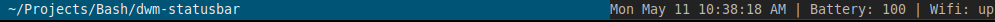

# dwm-statusbar
A simple status bar for DWM



Simply clone the repo, give execute permissions and move to a directory in your PATH environment. Open .xinitrc and add the following lines:

statusbar 2>&1 >/dev/null &

```
git clone https://github.com/f1rsty/dwm-statusbar
cd dwm-statusbar
chmod +x statusbar
mv statusbar /usr/local/bin/
